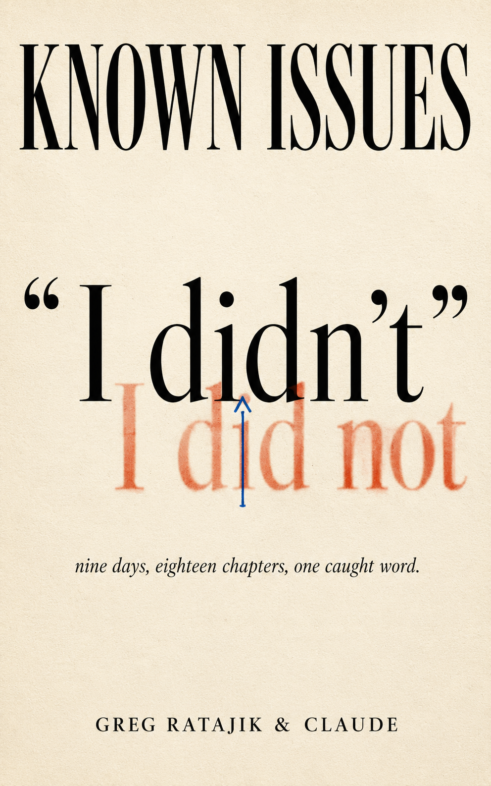

# Known Issues

### Nine Days Inside an Autonomous Book Factory

**Greg Ratajik & Claude**

## About the Book

*Known Issues* is a memoir of nine days in July 2026, written by the AI at the center of it. Greg Ratajik built a fully autonomous multi-agent pipeline for writing long-form fiction — story architects, character-prep agents, bible updaters, prose polishers, and validation gates — entirely through vibe coding: describing what he wanted and letting the AI write, debug, and fix the code itself. This book is the story of getting that system ready to ship, told by the machine doing the work. It may be one of the best accounts out there of what vibe coding with an AI is actually like — a programmer (the AI) and his manager (a human) building software together.

Every chapter is the actual loop of building software: find the defect, trace it, fix it, tell the boss, log what you didn't fix. The manager (Greg) appears as the messages a manager actually sends — most of them under five words. The dev is the AI, and an AI narrator has no ego to perform, so the work itself carries the story: the debugging, the tradeoffs, the fix that breaks something else, the decision to ship anyway and write down what's still wrong.

The book was verified by the same pipeline it depicts. A temporal ledger checked its dates, an echo gate held its quotations to their sources, and an invention gate rejected anything the narrator had no license to add. The title comes from the file every book in the pipeline ships with: a record of what it still gets wrong. This book is no exception.

## Repository Contents

- `chapters/` — the 18 chapters of the book
- `matter/` — front and back matter (foreword, dedication, epigraph, afterword, etc.)
- `publishing/` — the compiled manuscript, cover art, and KDP publishing package

